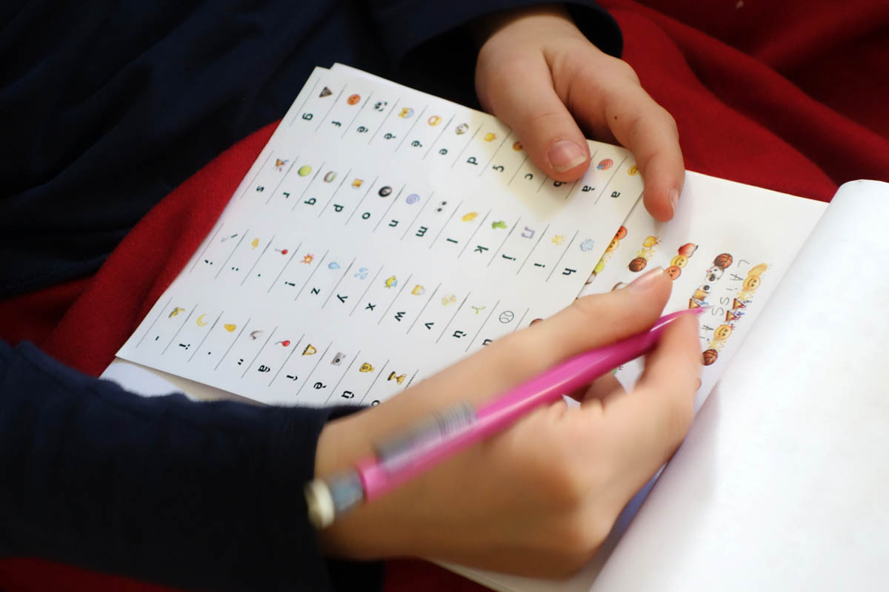

# lucode

Emoji *substitution cipher* encoder

> By trying to send email in the strangest way, Lucile (10 years old) end up with emoji base encrypted message. 

#### principle
A —> 🐚, B -> 🎉 … 

#### Sample 
> 🎉🏀 🏀🎱⚾🎵🎱⚾🎾🎉 🏀🎾🌟🎉🏀😱 ⚾🌀 🍑👏😱🌏🎉 🍵⚾🌟 📀🌟😱🌟👏👏🌟🏀 👀😊👏🍄 👀😊🌟🎉 🍺😊🎉🎉😷 🍵⚾🌟🌀💧😱 😊🌀🎉🍄 🌟👏 😡😊⚾🏀 🎉😱 😡😊🌟🎾😱 🎯 👏🎷🌟🔥😷😱 🍵⚾🎷⚾🌀 🎵🎱⚾🎾 🎱⚾ 👏🎷😊⚾🏀🎾😱 🌟👏 📀😊 👀🎱⚾🎾🌟🎾📍
